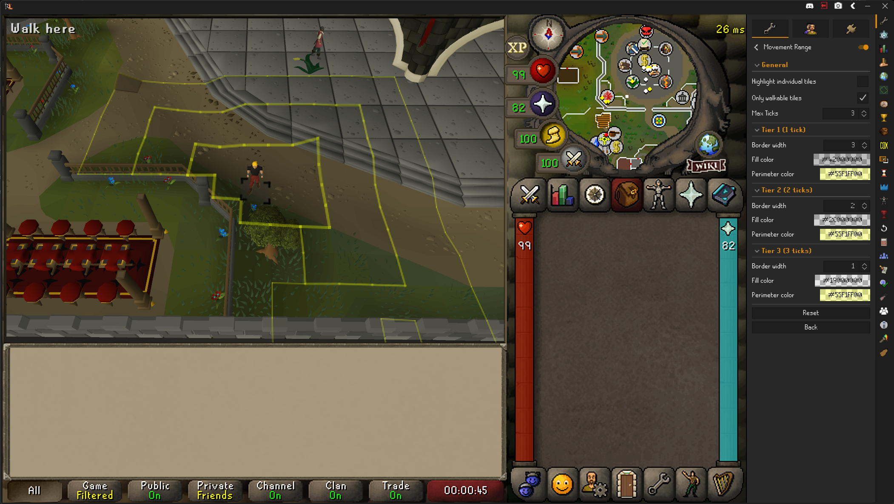

# Movement Range

Highlights the tiles you can reach in a configurable number of run ticks, with optional per-tier coloring.

## Features

- Highlights tiles reachable in 1–3 run ticks from the player's current position
- Each tick tier has its own fill color, perimeter color, and border width
- Optional outline around each individual tile inside the reachable region
- Respects walls and obstacles using the game's collision data

## Configuration

| Option | Description |
|--------|-------------|
| Max ticks | Number of run ticks to highlight (1–3) |
| Only walkable tiles | When enabled, walls and obstacles block the reachable region |
| Highlight individual tiles | Outlines each tile inside the reachable region |
| Tier N fill / perimeter / border width | Per-tier appearance settings |

## Notes

A run tick covers up to two tiles per game tick, so "1 tick" highlights the tiles you can reach in a single run tick (up to 8 surrounding tiles when unobstructed). Each subsequent tier extends two tiles further from the previous tier's frontier.
